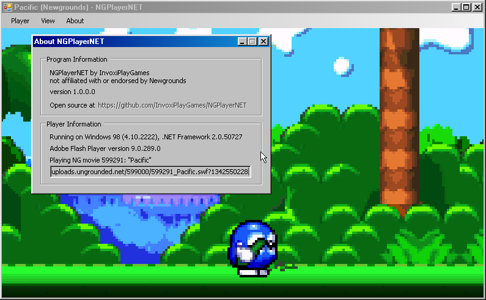

# NGPlayerNET

An unofficial replacement for the "Newgrounds Player" desktop program to watch
and play Flash movies and games from Newgrounds in a desktop app. Written in
.NET Framework 2.0 to be compatible with Windows 98 through Windows 11.

**This project is not affiliated with or endorsed by Newgrounds.**

*Movie: [Pacific](https://www.newgrounds.com/portal/view/599291) by Psycosis91 running in NGPlayerNET on Windows 98.*

## Why?

Fun project. I was fascinated by the Newgrounds Player but felt like it was
missing a few nice to haves, as well as a huge missed opportunity not working
on anything lower than Windows 7 with latest updates installed.

The only real difference between this and a typical Flash projector is that it
can automatically fetch a SWF when given a Newgrounds link, as well as having
functional Newgrounds medals and leaderboards support when launched via
Newgrounds.com. [Achievement Unlocked 2](https://www.newgrounds.com/portal/view/553791)
by jmtb02 (also on [Steam](https://store.steampowered.com/app/2274110/)) is a
good game.

For anything reliable on Windows 7 and up, check out and use the official
[Newgrounds Player](https://www.newgrounds.com/flash/player).

## Privacy

If you're on a version of Windows older than Windows 10 1709, and your system
can't reach Newgrounds.com over HTTPS, requests will be made over HTTP to a
relay hosted by me to fetch information about Newgrounds links, and any support
for medals and leaderboards will be disabled (since I don't want your Newgrounds
tokens.)

If you're, say, running a secure local TLS proxy yourself, you can disable this
in the NGPlayerNET Settings.

## Usage

### System Requirements

- Windows 98 Second Edition, 2000, XP, Vista, 7, 8.1, 10 or 11 - with the latest
  updates installed.
- At least 128MB RAM
- .NET Framework 2.0 *(included in Vista+, included in download)*
- Adobe Flash Player version 9 or later installed for IE/ActiveX *(included in download)*
   - **Windows 98**: Flash Player 9.0.289.0
   - **Windows 2000**: Flash Player 11.1.102.55
   - **Windows XP and later**: Flash Player 32.0.0.371 or patched Flash Player 32.0.0.445
- If on Windows 98, you'll need a ZIP file extractor such as 7-Zip.

*It might be annoying to install Flash Player ActiveX on Windows 8.1, 10 or 11,
you might just want to install [Newgrounds Player](https://www.newgrounds.com/flash/player)
first to make sure you have a working Flash Player ActiveX control.*

### Install Instructions

1. Download the release package ZIP from the [releases page](https://github.com/InvoxiPlayGames/NGPlayerNET/releases).
    - A HTTP-supporting mirror is hosted at http://ipg.pw/ngplayernet/
2. Extract it somewhere safe on your computer.
3. If needed, install .NET and Flash Player from the "Redistributables" folder.
4. Launch NGPlayerNET.exe.

### Using the Program

#### Playing Newgrounds movies from the browser

**This is the only way leaderboards and trophies will function.**

You only need to do this once:

1. Open NGPlayerNET.
2. Go to "About" -> "NGPlayerNET Settings"
3. Click "Install newgroundsplayer: URL handler..."

Then from any Newgrounds.com video or game's Flash page, click the link to open
in Newgrounds Player to open it in NGPlayerNET.

You might have to disable Ruffle and video replacements in your
[account settings](https://www.newgrounds.com/account).

#### Playing Newgrounds movies from a URL

1. Open NGPlayerNET.
2. Go to "Player" -> "Load Newgrounds Flash..."
3. Type or paste a Newgrounds Flash portal link or ID and click Load.

#### Playing locally stored SWF files

1. Open NGPlayerNET.
2. Go to "Player" -> "Load local SWF..."
3. Find the SWF file and open it.

You should probably just use the standalone Flash Player projector instead.

## Building

Use Visual Studio 2010.

## Shoutouts

- [Newgrounds](https://www.newgrounds.com) for being around for my entire life
(+ change) hosting this community and all the animations and games within.
- [Legacy Update](https://legacyupdate.net/) for restoring Windows Update on
Windows 2000/XP/Vista/7.
- [Windows Update Restored](https://www.windowsupdaterestored.com/) for
restoring Windows Update on Windows 98.
- [Internet Archive](https://archive.org/) for having safe archives of every
Flash Version.
